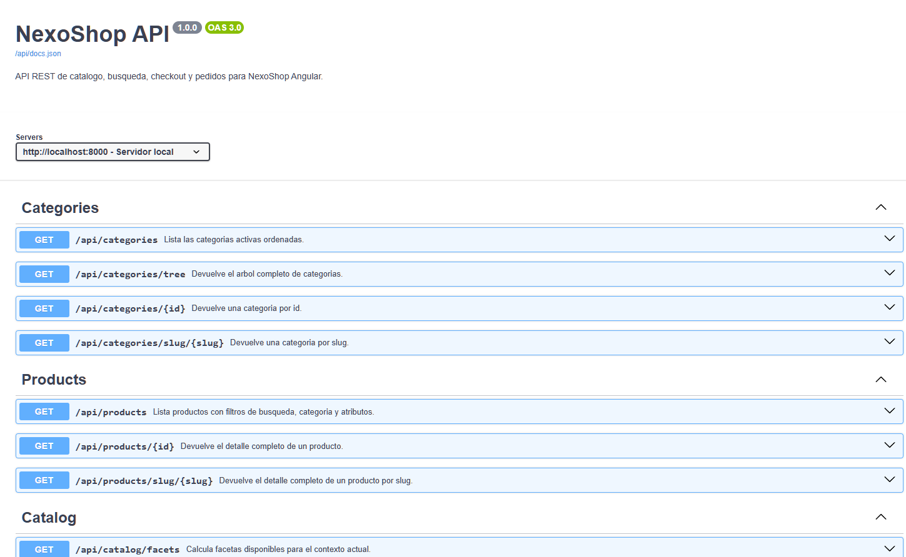
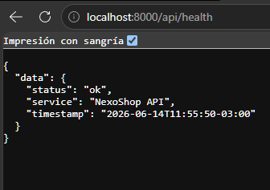
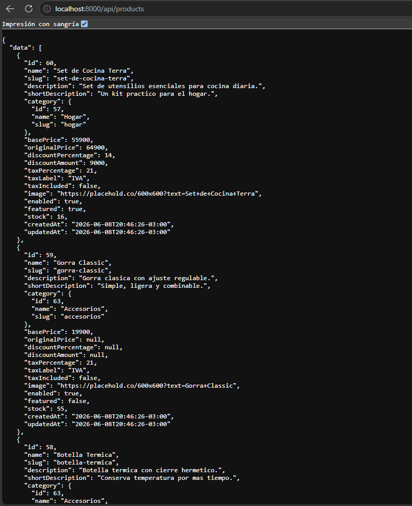
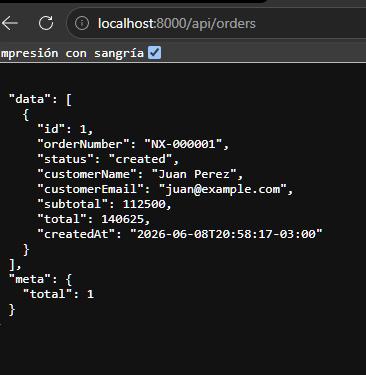
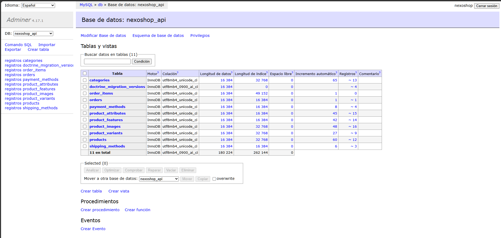

# NexoShop API

NexoShop API es una API REST desarrollada con Symfony para modelar el backend de un mini e-commerce. Incluye catálogo jerárquico, productos con variantes, filtros por facetas, búsqueda con sugerencias, métodos de envío y pago, creación de pedidos simulados, documentación OpenAPI y entorno Docker.

## Estado del proyecto

Versión portfolio funcional.

La API puede levantarse localmente con Docker, cargar fixtures, documentarse con Swagger/OpenAPI, consultarse desde un frontend Angular y crear pedidos simulados.

## Proyecto relacionado

Frontend Angular:
https://github.com/02Nico02/nexoshop-angular

Este backend fue creado para complementar ese frontend. Actualmente el frontend sigue usando datos mock locales. Esta API está preparada como backend de ejemplo para reemplazar progresivamente esos mocks, pero la integración real entre ambos proyectos no forma parte de esta versión.

## Alcance del proyecto

Esta API está pensada como backend de portfolio para un mini e-commerce. El foco está en modelar un dominio e-commerce simple, exponer endpoints REST documentados y permitir pruebas locales con Docker.

Incluye:

- catálogo de productos
- categorías jerárquicas
- variantes
- imágenes
- atributos filtrables
- facetas
- búsqueda con sugerencias
- métodos de envío
- métodos de pago
- pedidos simulados
- descuento de stock
- documentación OpenAPI
- CORS para Angular en desarrollo
- healthcheck
- paginación en productos

No incluye:

- autenticación de usuarios
- panel administrativo
- pagos reales
- subida real de imágenes
- integración productiva con el frontend
- despliegue en producción

## Tecnologías

- PHP 8.3
- Symfony 7.1
- Doctrine ORM
- Doctrine Migrations
- Doctrine Fixtures
- MySQL 8
- Docker
- Swagger/OpenAPI

## Requisitos

- Docker
- Docker Compose

## Inicio rápido

```bash
make build
make migrate
make fixtures
```

Servicios disponibles:

- API: `http://localhost:8000`
- Swagger/OpenAPI: `http://localhost:8000/api/docs`
- OpenAPI JSON: `http://localhost:8000/api/docs.json`
- Adminer: `http://localhost:8080`

Si preferís los comandos directos:

```bash
docker compose up -d --build
docker compose exec app php bin/console doctrine:migrations:migrate
docker compose exec app php bin/console doctrine:fixtures:load
```

## Variables de entorno

Copiá `.env.example` a `.env` si necesitás ajustar valores locales.

Variables principales:

- `APP_ENV`
- `APP_SECRET`
- `APP_TIMEZONE`
- `CORS_ALLOW_ORIGIN`
- `DATABASE_URL`

## Docker y herramientas

### Docker

- `app`: PHP 8.3 + Apache + Symfony
- `db`: MySQL 8
- `adminer`: interfaz visual para la base de datos

### Adminer

- URL: `http://localhost:8080`
- Sistema: `MySQL`
- Servidor: `db`
- Usuario: `nexoshop`
- Password: `nexoshop`
- Base de datos: `nexoshop_api`

### Makefile

- `make up`
- `make down`
- `make build`
- `make logs`
- `make bash`
- `make migrate`
- `make fixtures`
- `make reset-db`
- `make test`

## Comandos disponibles

### Levantar el proyecto

```bash
make build
```

### Detenerlo

```bash
make down
```

### Ver logs

```bash
make logs
```

### Entrar al contenedor

```bash
make bash
```

### Migraciones

```bash
make migrate
```

### Fixtures

```bash
make fixtures
```

### Reset de base

```bash
make reset-db
```

### Tests

```bash
make test
```

Antes de correrlos, asegurate de tener la base de datos levantada y las migraciones aplicadas:

```bash
docker compose exec app php bin/console doctrine:migrations:migrate -n
```

## Documentación OpenAPI

La documentación interactiva está disponible en:

- `GET /api/docs`
- `GET /api/docs.json`

Swagger UI permite explorar los endpoints, probar requests y revisar esquemas de respuesta.

## Endpoints principales

### Healthcheck

- `GET /api/health`

### Categorías

- `GET /api/categories`
- `GET /api/categories/tree`
- `GET /api/categories/{id}`
- `GET /api/categories/slug/{slug}`

### Productos

- `GET /api/products`
- `GET /api/products/{id}`
- `GET /api/products/slug/{slug}`

### Catálogo y facetas

- `GET /api/catalog/facets`

### Búsqueda

- `GET /api/search/suggestions?q=cam`

### Envíos

- `GET /api/shipping-methods`

### Pagos

- `GET /api/payment-methods`

### Pedidos

- `GET /api/orders`
- `GET /api/orders/{id}`
- `POST /api/orders`

## Ejemplos de uso

### Healthcheck

```bash
curl http://localhost:8000/api/health
```

### Listar productos paginados

```bash
curl "http://localhost:8000/api/products?page=1&limit=12"
```

### Filtrar productos

```bash
curl "http://localhost:8000/api/products?search=campera&category=abrigos&featured=true&sort=price_asc"
```

### Obtener facetas

```bash
curl "http://localhost:8000/api/catalog/facets?category=indumentaria&subcategory=abrigos"
```

### Buscar sugerencias

```bash
curl "http://localhost:8000/api/search/suggestions?q=cam"
```

### Crear pedido

```bash
curl -X POST http://localhost:8000/api/orders \
  -H "Content-Type: application/json" \
  -d '{
    "customer": {
      "name": "Nicolas Romero",
      "email": "nico@email.com",
      "phone": "1122334455"
    },
    "shippingAddress": {
      "street": "Calle 123",
      "city": "Chascomus",
      "province": "Buenos Aires",
      "postcode": "7130",
      "reference": "Casa con porton negro"
    },
    "shippingMethod": "standard",
    "paymentMethod": "credit_card",
    "paymentDetails": {
      "cardHolder": "Nicolas Romero",
      "lastFourDigits": "3456"
    },
    "items": [
      {
        "productId": 1,
        "variantId": 3,
        "quantity": 2
      }
    ]
  }'
```

## Formato de respuestas

### Listado

```json
{
  "data": [],
  "meta": {
    "total": 0
  }
}
```

### Listado paginado

```json
{
  "data": [],
  "meta": {
    "page": 1,
    "limit": 12,
    "totalItems": 0,
    "totalPages": 0
  }
}
```

### Detalle

```json
{
  "data": {}
}
```

### Error

```json
{
  "error": {
    "code": "PRODUCT_NOT_FOUND",
    "message": "Producto no encontrado"
  }
}
```

### Error con detalles

```json
{
  "error": {
    "code": "INSUFFICIENT_STOCK",
    "message": "Stock insuficiente",
    "details": {
      "productId": 1,
      "variantId": 3,
      "availableStock": 1
    }
  }
}
```

### Error de validación

```json
{
  "errors": [
    {
      "field": "customer.email",
      "message": "El email no es válido"
    }
  ]
}
```

## Flujo principal

1. El frontend consulta categorías y productos.
2. El usuario navega el catálogo usando filtros, búsqueda o categorías.
3. El frontend consulta el detalle de producto con imágenes, variantes, atributos y características.
4. El usuario arma un carrito localmente.
5. El checkout consulta métodos de envío y métodos de pago.
6. El frontend envía una orden a `POST /api/orders`.
7. El backend valida productos, variantes, stock, envío y pago.
8. El backend calcula subtotales, descuentos, impuestos, envío y total.
9. El backend crea un pedido simulado, descuenta stock y devuelve una confirmación.

El carrito no se persiste en backend en esta versión.

## Arquitectura general

- `src/Controller` concentra las rutas HTTP y respuestas JSON.
- `src/Service` contiene la lógica de negocio y helpers transversales.
- `src/Entity` modela el dominio persistente con Doctrine.
- `src/Repository` resuelve consultas y filtros del catálogo.
- `src/DataFixtures` carga datos iniciales para desarrollo.
- `migrations` versiona el esquema de base de datos.

## Decisiones técnicas

- Se modelaron los precios y totales como enteros para evitar errores de redondeo.
- Se separaron productos, variantes, imágenes, atributos y características para mantener el catálogo extensible.
- Los métodos de envío y pago se almacenan en tablas dedicadas para que el checkout dependa de datos configurables.
- Los pedidos se persisten como snapshot para conservar el estado histórico aunque cambie el catálogo.
- La documentación se generó sin dependencias extra, para no bloquear el arranque del proyecto con instalación de paquetes adicionales.
- CORS quedó limitado al origen de Angular en desarrollo.
- La API devuelve `data`, `meta` y errores JSON consistentes en los recursos principales.

## Tests

El proyecto incluye una base de tests automatizados de API.

Cobertura actual:

- healthcheck
- listado y detalle de productos
- categorías
- preflight CORS
- validaciones básicas de pedidos

Ejecutar:

```bash
make test
```

La cobertura puede ampliarse en futuras iteraciones.

## Capturas

### Documentación Swagger



### Healthcheck



### Catálogo de productos



### Creación de pedido



### Base de datos en Adminer



## Próximos pasos

- Ampliar cobertura de tests funcionales.
- Integrar progresivamente con NexoShop Angular.
- Agregar autenticación de usuarios.
- Crear panel administrativo.
- Agregar estados avanzados de pedido.
- Evaluar despliegue en un entorno cloud.

## Qué demuestra este proyecto

- diseño de API REST
- Symfony y Doctrine
- modelado de dominio e-commerce
- Docker
- migraciones y fixtures
- validaciones
- documentación Swagger
- integración con Angular
- paginación y filtros
- manejo de errores JSON
